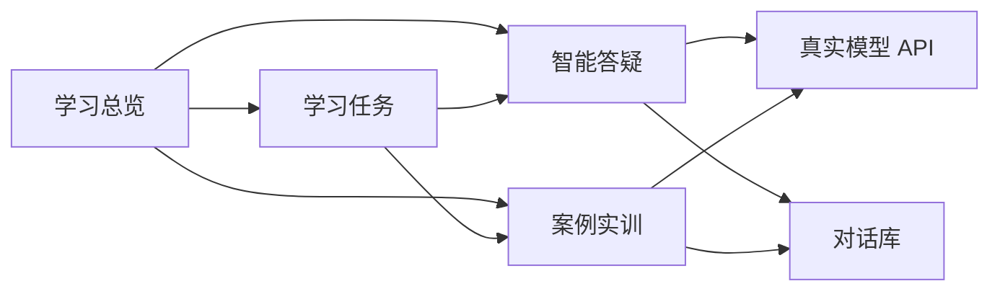

# NAU-AI-Assistant-Demo

审智学伴（Shizhi Xueban）是一个面向南京审计大学学生的 AI 学习助手 Demo，围绕审计学专业学习场景，提供智能答疑、案例实训、学习任务、学习画像和对话库等功能。

本项目用于创新竞赛和课堂演示，当前重点是验证“学习数据 + 大模型 + 学习任务”的产品流程，不是面向生产环境的完整教务系统。

## 功能概览

- **学习总览**：展示学习画像、知识点掌握度、今日推荐和学习任务。
- **智能答疑**：接入真实的大模型 API，支持连续提问、快捷问题和 Markdown 格式回答。
- **案例实训**：围绕审计案例进行分步作答，支持 AI 点评、继续追问和下一步练习。
- **对话库**：智能答疑和案例实训完成 AI 互动后自动保存，可打开历史记录并继续对话。
- **学习画像**：支持填写年级、专业、学习目标和每周学习时间，用于生成个性化学习提示。
- **学习通记录导入入口**：支持选择 CSV、Excel、JSON、图片或 PDF 文件；当前 Demo 主要演示导入流程，尚未接入学习通账号登录或完整的数据解析服务。
- **教务动态速览**：通过本地服务端代理读取 [南京审计大学教务处网站](https://jw.nau.edu.cn/) 的公开通知链接。
- **模型能力适配**：根据模型名称识别 DeepSeek、Qwen 等模型的思考能力，并调整思考模式和输出长度。

## 界面预览

项目采用简洁的 Apple 风格界面，主要页面包括：

1. 学习总览
2. 智能答疑
3. 案例实训
4. 对话库
5. 学习任务
6. 模型接入

## Windows 快速启动

### 运行环境

- Windows 10 或 Windows 11
- Node.js 20 或更高版本
- npm 或 pnpm

### 推荐方式：双击启动

双击项目根目录中的：

```text
start-services.bat
```

脚本会自动启动前端页面和本地 API 代理，并打开：

```text
http://127.0.0.1:5173/
```

首次运行时，如果本地没有依赖，启动脚本会尝试自动安装项目依赖。

关闭服务时双击：

```text
stop-services.bat
```

### 手动启动

在项目根目录执行：

```powershell
pnpm install
node server.mjs
```

另开一个终端启动前端：

```powershell
pnpm exec vite --host 127.0.0.1 --port 5173
```

如果使用 npm，可将 `pnpm install` 替换为 `npm install`，将 `pnpm exec vite` 替换为 `npm exec -- vite`。

## 接入真实模型

进入左侧的“模型接入”页面，填写：

- 模型供应商
- 模型名称
- Base URL
- API Key

项目使用 OpenAI-compatible 的聊天接口格式。Base URL 可以填写接口根地址，例如：

```text
https://api.deepseek.com/v1
```

也可以直接填写以 `/chat/completions` 结尾的完整地址。服务端会自动补全接口路径，并将上游返回的普通 JSON 或 SSE 响应统一转换为前端可识别的格式。

模型配置只保存在当前浏览器的本地存储中，不会写入 GitHub 仓库。API Key 不会写入项目服务端的数据文件；演示结束后请在“模型接入”页面清除本机配置。

## 核心流程



## 本地服务接口

本地 API 代理默认运行在 `8787` 端口：

| 接口 | 作用 |
| --- | --- |
| `POST /api/chat` | 通过本地代理请求真实模型 |
| `GET /api/conversations` | 读取历史对话 |
| `POST /api/conversations` | 新增或更新对话 |
| `DELETE /api/conversations/:id` | 删除历史对话 |
| `GET /api/academic-news` | 获取教务处公开通知摘要 |

本地 API 代理的主要作用是减少浏览器跨域问题，并兼容部分返回 SSE 格式的模型接口。

## 项目结构

```text
.
├─ src/
│  ├─ App.jsx          # 页面、路由状态和主要交互
│  ├─ main.jsx         # React 入口
│  └─ styles.css       # Apple 风格界面样式
├─ server.mjs          # 本地 API 代理、对话文件存储和教务动态读取
├─ index.html          # 前端 HTML 入口
├─ package.json        # 项目脚本和依赖
├─ pnpm-lock.yaml      # 依赖锁定文件
├─ start-services.bat  # Windows 启动脚本
├─ stop-services.bat   # Windows 停止脚本
└─ start-dev.ps1       # 启动前端和本地代理的 PowerShell 脚本
```

## 数据与隐私说明

- 对话历史以 JSON 文件形式保存，不使用数据库，适合单机 Demo 使用。
- 运行时数据默认写入 `data/conversations.json`，该文件不会提交到 GitHub。
- API Key 仅保存在当前浏览器的本地存储中，项目代码不内置任何真实密钥。
- 项目不会读取学习通账号密码；学习通数据需要由用户主动选择文件导入。
- 当前版本没有用户登录、权限管理、多用户隔离和云端数据库，不建议直接用于正式教学环境。

## 开发与构建

启动开发服务器：

```powershell
pnpm run dev
```

构建生产前端：

```powershell
pnpm run build
```

构建产物会生成在 `dist/` 目录中。该目录属于构建结果，不作为源代码提交。

## 当前 Demo 的边界

当前版本已经打通从学习画像、模型接入、真实问答、案例点评到对话保存的主要演示链路，但以下能力仍属于后续完善方向：

- 学习通数据的真实解析和自动同步
- 对成绩、错题、知识点标签的结构化分析
- 多用户登录和教师端管理
- 数据库、权限控制和云端部署
- 更完善的模型供应商错误重试和限流策略

## License

本项目采用 [MIT License](./LICENSE) 开源。你可以自由使用、修改和再发布本项目，但请保留原许可证和版权声明。
